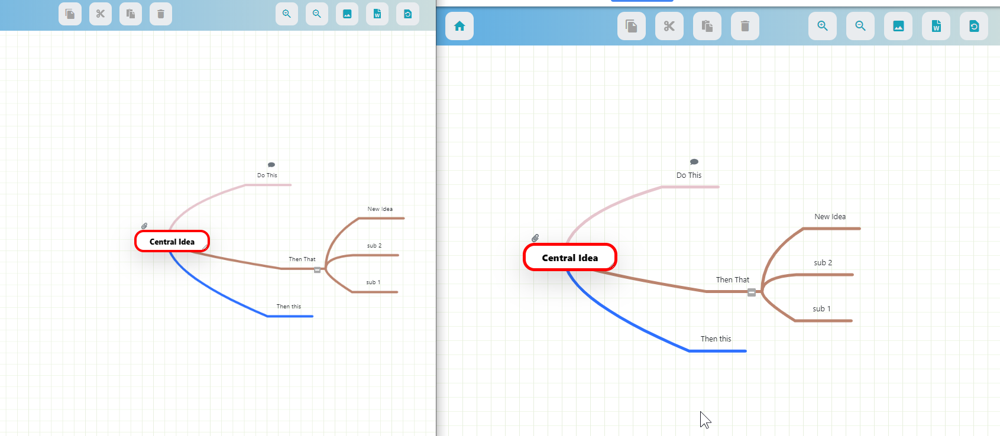

# Mindmaps

There was once a number of open source real time mindmaps but couldn't find one so we built it.  Like Etherpad, Ethercalc, Scrumblr, you and a number of others can mind map together at the same time by simply sharing a link.  You can attach files, or add notes to each node.

You can export the mindmap in png but my all time favorite feature and the one that is most useful is the ability to export the image to a hierarchical word document.  ITs easy to re-arrange the order.  Simply drag and drop and that order will be preserved, then click download and now you have an outline including the notes you might have included for each node like so.

# update centos

yum update

yum install -y epel-release yum-utils

yum-config-manager --enable epel

yum clean all && sudo yum update -y

# install ruby

gpg --keyserver hkp://keys.gnupg.net --recv-keys 409B6B1796C275462A1703113804BB82D39DC0E3

curl -sSL https://get.rvm.io | sudo bash -s stable

usermod -a -G rvm `username'

export PATH="$PATH:$HOME/.rvm/bin"

log out then log back in

rvm install ruby-2.6.1

rvm install ruby-devel-2.6.1

bash -l -c "rvm use 2.6.1 --default"

# Install Mysql
yum install mariadb-server mariadb

yum install mysql-devel

systemctl start mariadb

systemctl enable mariadb

mysql_secure_installation

mysql -u root -p

create database mindmaps_dev CHARACTER SET utf8 COLLATE utf8_general_ci;

exit

# be sure git is installed
yum install git

# Install Redis
yum install redis

systemctl start redis

systemctl enable redis

# go to /var/www and from there 
cd /var/www/

git clone https://github.com/MicroHealthLLC/mindmap

nano /var/www/mindmap/config/database.yml

--enter the password for mysql where it says password then save and exit

# go to the cloned directory 
cd /var/www/mindmap

gem install rails

gem install bundler

yum install nodejs

Install Yarn: https://yarnpkg.com/lang/en/docs/install/#centos-stable

bundle install

rails db:setup 

rake db:seed

rake assets:precompile

# generate your secrets for config/secrets.yml

rake secret

put that output in config/secrets.yml

# Configure Nginx repo for CentOS 7

nano /etc/yum.repos.d/nginx.repo

# then enter this below and save

[nginx-stable]

name=nginx stable repo

baseurl=http://nginx.org/packages/centos/$releasever/$basearch/

gpgcheck=1

enabled=1

gpgkey=https://nginx.org/keys/nginx_signing.key

# Update yum and install nginx
yum update

yum install -y nginx

sudo systemctl enable nginx

# update environment files for cable

nano /var/www/mindmap/config/enviroments/development.rb AND
nano /var/www/mindmap/config/enviroments/production.rb past this below

        config.web_socket_server_url = 'ws://YOURIPADDRESS/cable'
        config.action_cable.allowed_request_origins = [/http:\/\/*/, /https:\/\/*/]

# edit nginx.conf 

    upstream mindmap {
        server unix:/var/www/mindmap/tmp/rails.sock;
        }

    server {
        listen       80 default_server;
        server_name  localhost;
        root         /var/www/mindmap/public;
        
      location / {
       try_files /maint.html $uri @ruby;
        }

        location @ruby {
        proxy_pass http://mindmap;
        proxy_set_header X-Real-IP $remote_addr;
        proxy_set_header X-Forwarded-For $proxy_add_x_forwarded_for;
        proxy_set_header Host $http_host;
        proxy_redirect off;

        location /cable {
                proxy_pass http://mindmap;
                proxy_http_version 1.1;
                proxy_set_header Upgrade $http_upgrade;
                proxy_set_header Connection "upgrade";
                }

# Start Puma

cd /var/www/mindmap

bundle exec puma -C config/puma.rb -e production

# restart nginx
service nginx restart

# Upgrades
cd /var/www/mindmap

git pull

bundle install

rake db:migrate

RAILS_ENV=production bin/webpack

rake assets:precomple

chown -R nginx:nginx *

kill puma process then

bundle exec puma -C config/puma.rb -e production

service nginx restart

